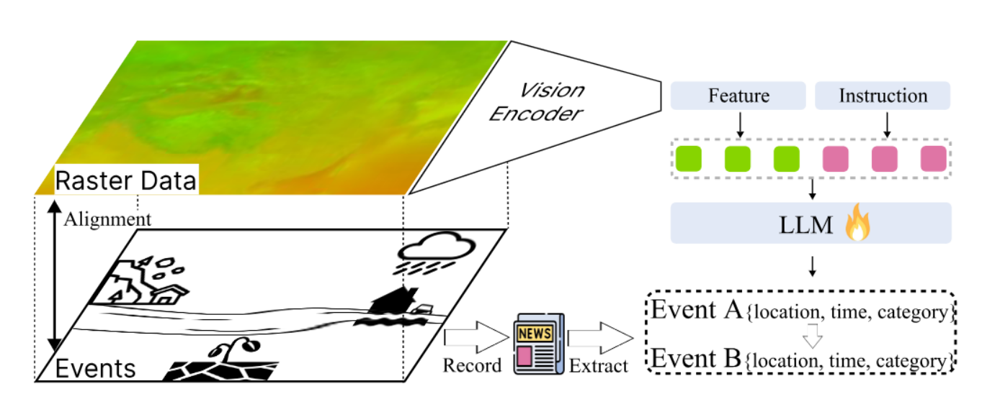
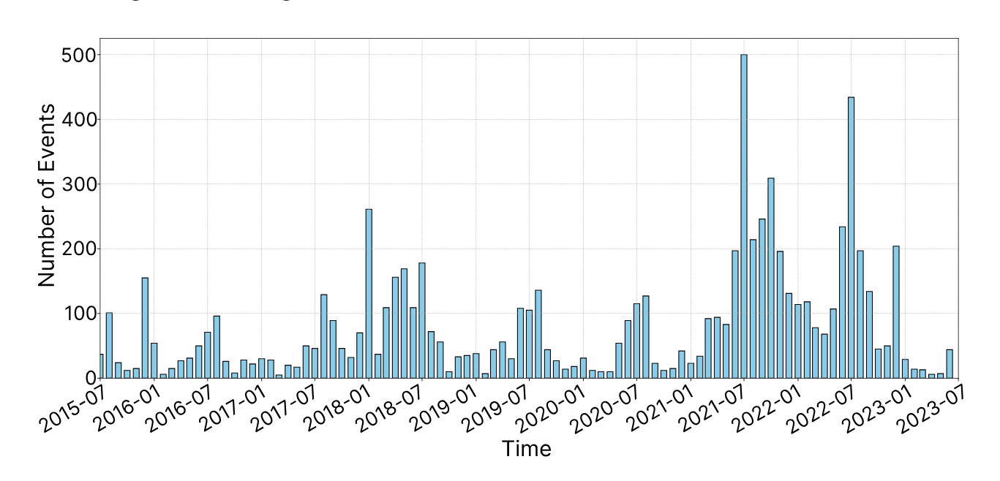

# CLLMate

## Table of Contents
- [CLLMate](#introduction)
  - [Introduction](#introduction)
  - [Format](#format)
- [Benchmarking](#benchmarking)
- [Citation](#citation)


## CLLMate
### Introduction


We present CLLMate, the first multimodal dataset (./data/dataset_cllmate.json) for **W**eather and **C**limate **E**vent **F**orecasting (WCEF), using 26,156 environmental news articles aligned with ERA5 reanalysis data.

The spatial distribution of the dataset:


The temporal distribution of the dataset:


### Format


```json
{
    "event_id":
    {
        "event": [event description],
        "time": [date of event],
        "location": [location of event],
        "coordinate": [coordinate of event],
        "caused by": [caused by "event_id"],
        "cause": [cause "event_id"],
        "news_id": [the id of the news article],
        "image_path": [the meteorological raster image]
        "
    }
}
```

> [!NOTE]
> For the meteorological raster data, please refer to ERA5 dataset accoring to the time and coordinate.

## Benchmarking

We systematically benchmark 32 existing models on CLLMate, including closed-source, open-source, and our fine-tuned models.
Our experiments reveal the advantages and limitations of existing MLLMs and the value of CLLMate for the training and benchmarking of the WCEF task.

The main result:


The abalation result:


Impact of Model Scale:


## Benchmarking
If you find CLLMate useful for your research and applications, please cite using this BibTeX:

```json
@article{li2024cllmate,
  title={Cllmate: A multimodal llm for weather and climate events forecasting},
  author={Li, Haobo and Wang, Zhaowei and Wang, Jiachen and Lau, Alexis Kai Hon and Qu, Huamin},
  journal={arXiv preprint arXiv:2409.19058},
  year={2024}
}
```

